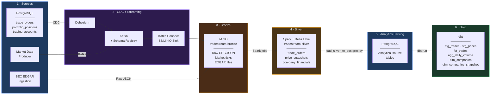

# TradeStream Lakehouse

**A fully functional, end-to-end data lakehouse pipeline for trading and market intelligence — built locally with production-grade tooling.**

This project captures real-time trading data changes from a transactional database, streams them through Kafka, lands raw data in object storage, transforms it through Bronze and Silver layers using Spark and Delta Lake, loads curated datasets into an analytics-serving database, and builds dimensional Gold models with dbt — all orchestrated by Airflow and running entirely in Docker Compose.

---

## What this project demonstrates

- **Change Data Capture (CDC)** — Debezium captures row-level changes from PostgreSQL and publishes them to Kafka in real time
- **Stream processing architecture** — Kafka brokers, Schema Registry, and Kafka Connect work together to move data reliably from source to storage
- **Medallion lakehouse design** — Bronze (raw), Silver (cleaned/typed), and Gold (modeled) layers with clear separation of concerns
- **Spark + Delta Lake** — PySpark jobs read raw data from object storage, deduplicate CDC events, enforce schemas, and write Delta tables
- **Analytics engineering with dbt** — staging models, fact/dimension tables, schema tests, and SCD Type 2 snapshots
- **Pipeline orchestration** — Airflow DAGs coordinate ingestion, transformation, loading, and modeling
- **Infrastructure as code** — the entire stack runs in Docker Compose with a custom Airflow image that includes Java and Spark dependencies

---

## Architecture

> **How to read this diagram:** Data flows left to right through six stages. Each arrow represents a validated, working data connection. The row counts at the bottom are real results from the pipeline.



### Airflow orchestration spans stages 2 through 5

Airflow runs in Docker alongside all other services. A Silver Transformations DAG coordinates the Spark jobs that move data from Bronze to Silver. The custom Airflow Docker image includes Java 17 and PySpark to run Spark jobs directly inside the Airflow containers.

---

## Validated pipeline results

These are actual row counts from the fully executed pipeline — not sample data or mock outputs:

| Table | Row count | Layer | Description |
|---|---:|---|---|
| `public.fct_trades` | **87,672** | Gold | Fact table — every trade with execution details |
| `public.dim_companies` | **1,208** | Gold | Company financial metrics from SEC filings |
| `public.dim_companies_snapshot` | **1,208** | Gold | SCD2 snapshot tracking changes over time |
| `public.company_financials` | **1,208** | Silver → Postgres | Flattened SEC EDGAR fundamentals |
| `public.price_snapshots` | **120** | Silver → Postgres | Cleaned market price ticks |
| `public.agg_daily_volume` | **20** | Gold | Daily trading volume aggregation |

---

## Tech stack

| Layer | Technology | Purpose |
|---|---|---|
| Source database | PostgreSQL | Transactional trading data (trade_orders, portfolio_positions, trading_accounts) |
| Change data capture | Debezium | Captures row-level INSERT/UPDATE/DELETE events from Postgres WAL |
| Message broker | Apache Kafka | Streams CDC events and market data between producers and consumers |
| Schema management | Confluent Schema Registry | Manages Avro schemas for Kafka topics |
| Data movement | Kafka Connect + S3 Sink | Writes Kafka topic data to MinIO object storage |
| Object storage | MinIO | S3-compatible local storage for Bronze and Silver layers |
| Processing engine | Apache Spark (PySpark) | Reads Bronze, deduplicates, transforms, writes Silver Delta tables |
| Table format | Delta Lake | ACID transactions and schema enforcement on the lakehouse |
| Analytics serving | PostgreSQL | Serves curated Silver data as source tables for dbt |
| Data modeling | dbt-core | Builds staging views, fact/dimension tables, tests, and snapshots |
| Orchestration | Apache Airflow | Schedules and monitors pipeline stages |
| Infrastructure | Docker Compose | Runs all 10+ services locally with networking and volumes |

---

## End-to-end data flow

### Stage 1 — Source data generation

A trading simulator writes transactional data into PostgreSQL. The core table `trade_orders` contains columns like `order_id`, `account_id`, `ticker_symbol`, `order_type`, `quantity`, `limit_price`, `executed_price`, `status`, `placed_at`, `executed_at`, and `updated_at`. Two supporting tables (`portfolio_positions` and `trading_accounts`) track account state.

A market data producer publishes price tick events to a Kafka topic (`market.price_updates`). A separate SEC EDGAR ingestion script fetches real company financial facts from the SEC API for five tickers (AAPL, MSFT, AMZN, NVDA, GOOGL) and stores the raw JSON.

### Stage 2 — CDC and streaming

Debezium monitors the PostgreSQL write-ahead log (WAL) and publishes change events to Kafka topics (`trading.public.trade_orders`, `trading.public.portfolio_positions`, `trading.public.trading_accounts`). Each event includes the full row state before and after the change, the operation type (create/update/delete), and a timestamp. The Schema Registry manages the Avro schemas for these topics.

### Stage 3 — Bronze landing

Kafka Connect's S3/MinIO Sink connector continuously writes topic data into the `tradestream-bronze` bucket in MinIO. Data arrives as raw JSON files partitioned by topic. The SEC EDGAR ingestion script also writes its raw JSON output directly to Bronze. No transformations happen at this stage — Bronze is the immutable record of everything that arrived.

### Stage 4 — Silver transformation

Three PySpark jobs read from Bronze and write curated Delta tables into the `tradestream-silver` bucket:

- **`silver_trade_orders.py`** — Extracts the Debezium payload, deduplicates by `order_id` (keeping the latest CDC event by timestamp), casts types, normalises column values, and writes a Delta table with MERGE upsert semantics.
- **`silver_price_snapshots.py`** — Cleans market price ticks, deduplicates by `(ticker, event_timestamp)`, filters invalid prices, and writes a Delta table partitioned by trade date.
- **`silver_company_financials.py`** — Flattens the deeply nested SEC EDGAR JSON structure into one row per (ticker, metric, period, form_type), filters to 10-K and 10-Q filings only, and writes a Delta table partitioned by ticker.

Spark connects to MinIO using the S3A filesystem connector with the MinIO service hostname (`http://minio:9000`) inside Docker.

### Stage 5 — Analytics serving load

A Python loader script (`load_silver_to_postgres.py`) reads the Silver Delta tables from MinIO via Spark and loads them into PostgreSQL analytical source tables. This bridge step makes the curated data available to dbt, which connects to Postgres. The loader uses append mode with explicit column selection to avoid conflicts with dependent database objects.

### Stage 6 — Gold modeling with dbt

dbt builds the analytical layer on top of the PostgreSQL source tables:

- **Staging models** — `stg_trades` (renames `ticker_symbol` to `ticker`, adds computed columns) and `stg_prices` (adds time dimensions)
- **Fact table** — `fct_trades` (87,672 rows) — one row per trade with full execution details
- **Aggregation** — `agg_daily_volume` (20 rows) — daily trading volume summary
- **Dimension** — `dim_companies` (1,208 rows) — company financial metrics from SEC data
- **Snapshot** — `dim_companies_snapshot` (1,208 rows) — SCD Type 2 history tracking (required setting `REPLICA IDENTITY FULL` on the Postgres source table)

All dbt tests pass: `not_null`, `unique`, and `accepted_values` validations on key columns.

---

## Key engineering challenges solved

These are real problems encountered during development, not theoretical exercises:

**Docker networking mismatches.** Spark and Airflow containers couldn't reach MinIO at `localhost:9000` because inside Docker, `localhost` refers to the container itself. Fixed by configuring the S3A endpoint to use the Docker service hostname `http://minio:9000`. This same class of issue affected multiple components — every inter-service connection had to use Docker DNS names, not localhost.

**Airflow needed Java and Spark.** The default Airflow Docker image doesn't include Java or PySpark. Built a custom Airflow Dockerfile that installs Java 17 and all Spark/Delta dependencies so Airflow can execute Spark jobs directly. Also had to fix the DAG's Python path — it initially referenced the host machine's Python (`/opt/anaconda3/bin/python`) instead of the container's Python.

**Source schema drift broke dbt models.** Initial dbt models assumed column names like `trade_id` and `ticker` based on early design. The actual Postgres source uses `order_id` and `ticker_symbol`. Every staging model, mart, and test had to be rewritten to match the real schema. This is a realistic data engineering problem — source schemas change and downstream models must adapt.

**Silver-to-Postgres loader conflicts.** The first version used overwrite mode, which dropped and recreated tables — destroying dependent dbt views. Switched to append mode with explicit column selection so the loader aligns with the destination schema without breaking downstream objects.

**PySpark + Delta Lake version pinning.** Local Spark execution required exact version compatibility: PySpark 3.5.1 + Delta Spark 3.2.0 + Java 11 (on Mac). Mismatched versions produced cryptic runtime errors. Pinned all versions explicitly.

**Postgres snapshot prerequisites.** dbt snapshots using the `check` strategy on Postgres require `REPLICA IDENTITY FULL` on the source table, otherwise Postgres doesn't include unchanged columns in UPDATE events. Diagnosed and applied this setting to make `dim_companies_snapshot` work.

---

## Project structure

```
tradestream-lakehouse/
│
├── app/
│   ├── producer/
│   │   ├── market_data_producer.py        # Publishes price ticks to Kafka
│   │   └── sec_ingestion.py               # Fetches SEC EDGAR company facts
│   └── silver/
│       ├── spark_config.py                # Shared Spark + MinIO + Delta config
│       ├── silver_trade_orders.py         # Bronze CDC → Silver Delta (dedup + merge)
│       ├── silver_price_snapshots.py      # Bronze market ticks → Silver Delta
│       └── silver_company_financials.py   # Bronze EDGAR JSON → Silver Delta
│
├── dbt/
│   ├── models/
│   │   ├── staging/
│   │   │   ├── stg_trades.sql             # Staged trade orders
│   │   │   └── stg_prices.sql             # Staged price snapshots
│   │   └── marts/
│   │       ├── fct_trades.sql             # Fact: 87,672 trade records
│   │       ├── agg_daily_volume.sql       # Daily volume aggregation
│   │       └── dim_companies.sql          # Company financial dimensions
│   ├── snapshots/
│   │   └── dim_companies_snapshot.sql     # SCD2 tracking
│   └── tests/                             # Schema + singular tests
│
├── dags/
│   └── silver_transformations_dag.py      # Airflow DAG for Spark jobs
│
├── scripts/
│   └── load_silver_to_postgres.py         # Silver Delta → Postgres analytics
│
├── airflow/
│   └── Dockerfile                         # Custom Airflow image with Java + Spark
│
├── docker-compose.yml                     # Full local infrastructure
└── README.md
```

---

## How to run

### Prerequisites

- Docker and Docker Compose
- Python 3.10+
- Java 11+ (for local Spark execution outside Docker)

### 1. Start the infrastructure

```bash
docker compose up -d
```

This starts PostgreSQL, Zookeeper, Kafka, Schema Registry, Kafka Connect, Kafka UI, MinIO, Airflow webserver, and Airflow scheduler.

### 2. Initialize the source database

Run the trading simulator to populate `trade_orders`, `portfolio_positions`, and `trading_accounts` in PostgreSQL.

### 3. Set up CDC

Deploy the Debezium PostgreSQL source connector and the Kafka Connect S3/MinIO sink connector. Verify topics are created in Kafka UI (port 8080).

### 4. Run ingestion

```bash
# Market data → Kafka → Bronze
python app/producer/market_data_producer.py

# SEC EDGAR → Bronze
python app/producer/sec_ingestion.py
```

### 5. Run Silver transformations

Trigger the Silver Transformations DAG in Airflow (port 8082), or run manually:

```bash
python -m app.silver.silver_trade_orders
python -m app.silver.silver_price_snapshots
python -m app.silver.silver_company_financials
```

### 6. Load Silver into Postgres

```bash
python scripts/load_silver_to_postgres.py
```

### 7. Build Gold models

```bash
cd dbt
dbt run
dbt test
dbt snapshot
```

### 8. Verify results

```sql
SELECT count(*) FROM public.fct_trades;           -- 87,672
SELECT count(*) FROM public.dim_companies;         -- 1,208
SELECT count(*) FROM public.price_snapshots;       -- 120
SELECT count(*) FROM public.agg_daily_volume;      -- 20
SELECT count(*) FROM public.dim_companies_snapshot; -- 1,208
```

---

## What I would change in a production environment

This project is intentionally local-first. Here's what a production deployment would look like:

| Area | Current (local) | Production target |
|---|---|---|
| Object storage | MinIO | AWS S3 or GCS |
| Orchestration | Airflow in Docker | Managed Airflow (MWAA) or Dagster Cloud |
| Streaming | Single Kafka broker | Confluent Cloud or Amazon MSK |
| Compute | Local PySpark | EMR / Dataproc / Databricks |
| Gold layer | dbt → Postgres | dbt → Snowflake, BigQuery, or Trino over Delta |
| Silver → Gold bridge | `load_silver_to_postgres.py` | Eliminate — dbt reads Delta/Iceberg directly via Trino or dbt-spark |
| Secrets | Hardcoded in config | AWS Secrets Manager / HashiCorp Vault |
| CI/CD | Manual | GitHub Actions: lint → pytest → dbt compile → deploy |
| Monitoring | Airflow UI | Datadog / Grafana + PagerDuty alerting |
| IaC | docker-compose.yml | Terraform modules for all cloud resources |
| Data quality | dbt tests | Great Expectations or Soda + automated anomaly detection |
| Data contracts | Implicit schema | Protobuf schemas + contract tests on Kafka topics |

---

## Technologies used


